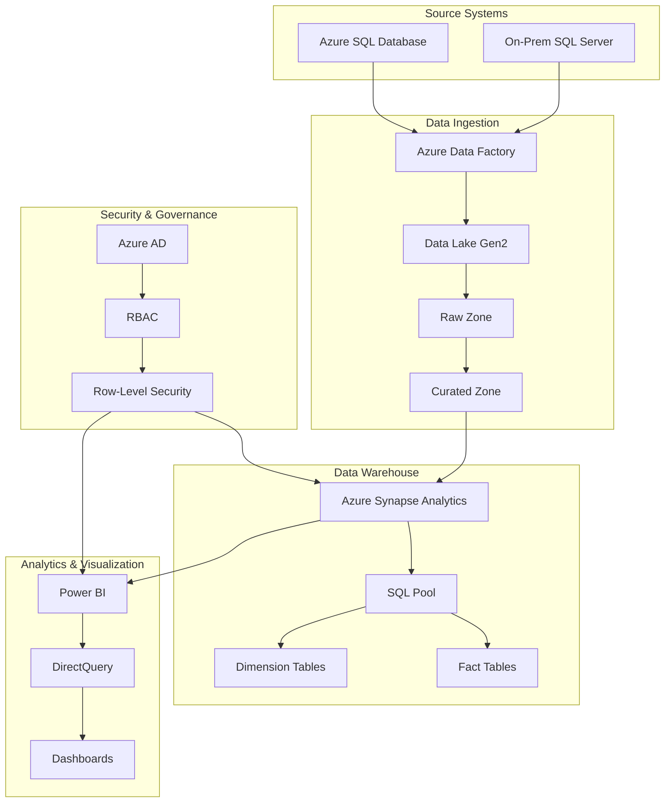

# Azure-Based Enterprise Data Warehouse Modernization

## Overview
This project implements a modern cloud-native data warehouse solution using Azure services, migrating from legacy on-prem SQL Server to a scalable, secure, and performant architecture.

## Architecture



## Key Components

### 1. Data Ingestion Layer
- **Azure Data Factory (ADF)**
  - Orchestrates ETL/ELT processes
  - Handles data movement and transformation
  - Supports multiple source systems
  - Implements data quality checks

### 2. Data Storage Layer
- **Azure Data Lake Gen2**
  - Raw zone for landing data
  - Curated zone for transformed data
  - Hierarchical namespace support
  - Cost-effective storage tiers

### 3. Data Warehouse Layer
- **Azure Synapse Analytics**
  - Dedicated SQL pool for analytics
  - Star/snowflake schema implementation
  - Optimized for query performance
  - Built-in workload management

### 4. Analytics & Visualization
- **Power BI**
  - DirectQuery for real-time analytics
  - Interactive dashboards
  - Row-level security
  - Scheduled refreshes

### 5. Security & Governance
- **Azure AD Integration**
  - Role-based access control (RBAC)
  - Row-level security
  - Audit logging
  - Data encryption

## Prerequisites

### Azure Requirements
- Active Azure subscription
- Contributor access to create resources
- Azure AD tenant for authentication

### Tools Required
- Azure CLI
- Terraform
- Power BI Desktop
- SQL Server Management Studio (optional)

## Deployment

### 1. Infrastructure Setup
```bash
# Initialize Terraform
cd terraform
terraform init

# Apply infrastructure
terraform apply -auto-approve
```

### 2. Data Pipeline Configuration
1. Deploy ADF pipeline from `adf/pipelines/etl_pipeline.json`
2. Configure source and sink connections
3. Set up pipeline triggers

### 3. Data Warehouse Setup
1. Execute SQL scripts in `synapse/sql/`
2. Create dimension and fact tables
3. Set up indexes and statistics

### 4. Power BI Integration
1. Follow `powerbi/connection_guide.md`
2. Create data model
3. Implement security rules
4. Publish dashboards

## Directory Structure
```
azure-dw-modernization/
├── terraform/               # Infrastructure as Code
│   ├── main.tf             # Main Terraform configuration
│   ├── variables.tf        # Variable definitions
│   └── outputs.tf          # Output definitions
├── adf/                    # Azure Data Factory
│   └── pipelines/          # Pipeline definitions
│       └── etl_pipeline.json
├── synapse/               # Synapse Analytics
│   └── sql/              # SQL scripts
│       ├── dim_customer.sql
│       └── fact_sales.sql
├── powerbi/              # Power BI
│   └── connection_guide.md
└── README.md
```

## Monitoring & Maintenance

### Performance Monitoring
- Use Synapse Studio for query performance
- Monitor ADF pipeline runs
- Track Power BI refresh times
- Set up Azure Monitor alerts

### Cost Optimization
- Right-size Synapse SQL pool
- Implement data lifecycle management
- Use appropriate storage tiers
- Monitor resource utilization

### Security Maintenance
- Regular access reviews
- Update security policies
- Monitor audit logs
- Rotate credentials

## Clean Up
```bash
# Destroy infrastructure
cd terraform
terraform destroy -auto-approve
```

## Contributing
1. Fork the repository
2. Create a feature branch
3. Submit a pull request

## License
MIT License - See LICENSE file for details

